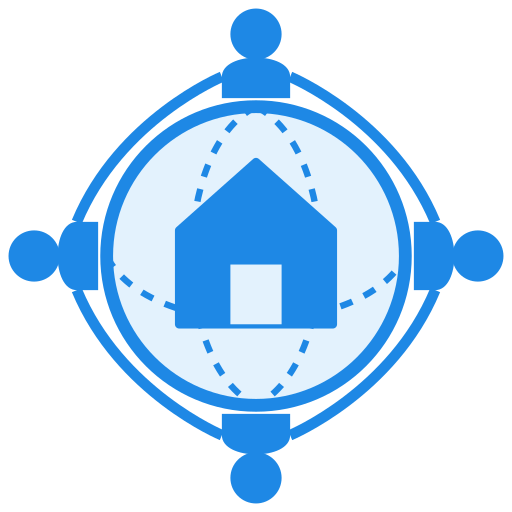

# YurtDostluk — The Global Civic & EdTech Infrastructure for Diaspora



**YurtDostluk** is a KYC-verified Super-App designed to formalize the $800B+ informal diaspora economy. It connects diaspora citizens with trusted services, academic support, embassy integration, and cross-border commerce in one secure platform.

## 🌍 Vision
To build an official, easy, and secure communication and service ecosystem that connects diaspora citizens with each other, their home authorities, host-country institutions, and willing supporters worldwide.

## 🚀 Current Status
This repository contains the **Public Website & Landing Pages** for YurtDostluk.
- **Public Site:** `index.html`, `about.html`, `platform.html`, `corridors.html`, `contact.html`, `investors.html`
- **Authentication:** `login.html` (Login/Register UI)
- **Admin & Portals:** Under development (React prototypes)

## 🛠️ Tech Stack
- **Public Website:** HTML5, Tailwind CSS (CDN), Vanilla JavaScript
- **App Prototype:** React (See `react-app/` folder)
- **Hosting:** Netlify (Live), GitHub Pages (Backup)

## 📂 Project Structure
```text
yurtdostluk-website/
├── index.html          # Landing Page
├── login.html          # Authentication
├── about.html          # About Us
├── platform.html       # Platform Features
├── corridors.html      # Corridor Architecture
├── contact.html        # Contact Form
├── investors.html      # Investor Pitch
├── 404.html            # Custom Error Page
├── assets/
│   ├── css/            # Global Styles
│   ├── js/             # Utilities & Scripts
│   └── images/         # Logos & Assets
└── admin/              # Admin Dashboard (Coming Soon)
